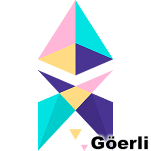

# DAppNodePackage-Goerli-Erigon

Goerli Erigon is an implementation of Ethereum (execution client), on the efficiency frontier, written in Go for the Goerli testnet.
By default Erigon is an archival node, but it can be configured to run in a pruned mode, which is the default setting for this package, but can be changed in the Config Tab of the Package.

|      Updated       | Champion/s |
| :----------------: | :--------: |
| :heavy_check_mark: | Voss (@alexpeterson91) |
